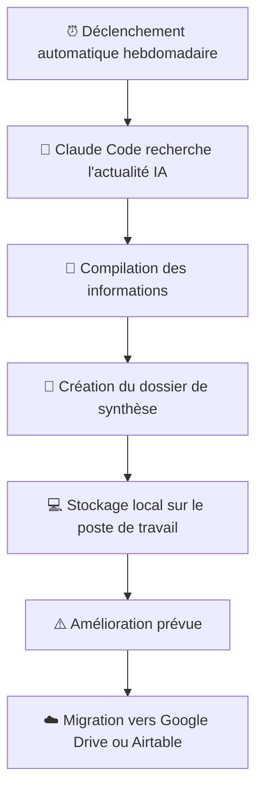

# Agent Veille MIA

## Objectif

Assurer une veille hebdomadaire automatisée sur l'actualité 
de l'intelligence artificielle, sans intervention manuelle.

## Flux de fonctionnement

1. L'agent se déclenche automatiquement chaque semaine
2. Claude Code recherche et compile les informations récentes sur l'IA
3. Un dossier de synthèse est créé localement sur le poste de travail

## Outils utilisés

- Claude Code (Anthropic)

## Statut

✅ En production

## Points d'amélioration identifiés

- Stocker les résultats dans Google Drive ou Airtable 
  plutôt que localement pour plus de fiabilité et d'accessibilité
- Permettre le partage des synthèses avec des clients
## Flux visuel

